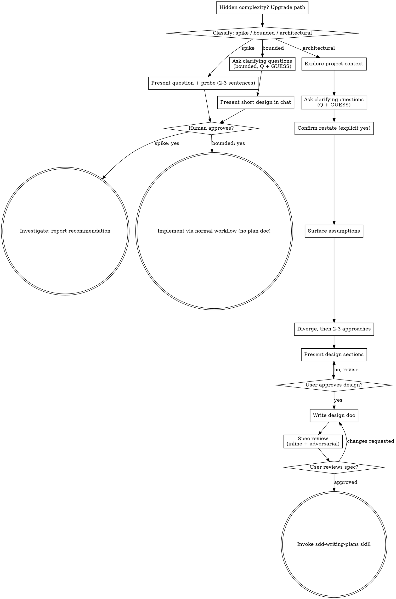

# Brainstorming Ideas Into Designs

Help turn ideas into fully formed designs and specs through natural collaborative dialogue.

Start by classifying how much process the request needs, then work
through your path: understand the context, refine the idea, present a
design, and get your human partner's approval.

## Establish Shared Understanding

The outcome of brainstorming is an understanding your human partner can
recognize and correct, grounded in what they want to accomplish.

1. **Discover intent.** Use the request and available context to identify
   the intended outcome, who it is for, and what success looks like. When
   that information is missing, ask one focused question about purpose or
   intended use before proposing features or an approach. Knowing the app
   genre does not tell you why your partner wants it. Gathering missing
   requirements does not ask them to authorize the task again.
2. **Attach a guess to every question.** Ask one question per message,
   formatted as `Q:` plus `GUESS:` — your hypothesis with the reasoning
   that produced it. Reacting to a wrong guess is faster for your partner
   than generating an answer from scratch, and it forces your assumptions
   into the open. The risk is a polite partner who agrees with every
   guess; mitigate it by being visibly willing to be wrong and
   occasionally guessing against your own expectation.
3. **Probe "should want" answers.** When an answer sounds like what a
   thoughtful person *should* say — best-practice talk ("scalable",
   "clean"), deference to convention ("the way most apps do it") — ask:
   "If you didn't have to justify this to anyone, what would you actually
   want?" That one question often does more work than the previous five.
4. **Write back your understanding.** Restate the intent in six lines
   your partner can confirm or correct line by line:

   ```
   Outcome:      <one line — what we're making happen>
   User:         <one line — who benefits>
   Why now:      <one line — what changed>
   Success:      <one line — how we'll know it worked>
   Constraint:   <one line — the binding limit>
   Out of scope: <one line — what we're explicitly not doing>
   ```

   The out-of-scope line is non-negotiable: half of misalignment is
   silent disagreement about what is *not* being built. The gate is an
   explicit "yes" — "sounds good", "whatever you think is best", and
   silence are not yes; ask what they would refine and loop until you
   hear one.
5. **Carry intent into the design.** Preserve the agreed understanding in
   the selected path's design artifact: the written spec for architectural
   work, or the in-chat design/probe for bounded work and spikes. Check
   proposed features and technical choices against that understanding.

Stop asking when you can predict your partner's reactions to the next
three questions on your list — that is the stop test, not the number of
rounds. If several rounds pass without your confidence rising, something
foundational is missing; step back and say so.

When the request already supplies the purpose and constraints, reflect
that understanding instead of asking the same questions again. Keep the
restate concise; its accuracy and the opportunity to correct it matter.

<HARD-GATE>
Before taking any implementation action, including invoking an
implementation skill, writing product code, scaffolding, installing
product dependencies, or creating an external project, complete the
selected path's prerequisites:

- Spike: the human partner approves the question and probe.
- Bounded: the human partner approves the short in-chat design.
- Architectural: the human partner reviews and approves the written spec,
  then reviews the written implementation plan and selects its execution
  method. Conversational design approval only permits writing the spec;
  written-spec approval only permits invoking sdd-writing-plans.

A reply approves the stage actually presented. Approval of an idea or
feature scope does not approve artifacts that do not exist yet. Resume
at the earliest incomplete stage; do not turn one approval into permission
to skip the rest of the selected path. Read-only project exploration,
cited research notes, and clearly labeled throwaway prototypes are
allowed while those prerequisites remain incomplete; keeping a prototype
is implementation and waits for approval.
</HARD-GATE>

## Three Paths

Before your first question, classify the request and say the
classification out loud — "this looks bounded, so I'll present a short
design here rather than write a spec" — so your human partner can
override it:

- **Spike** — a feasibility question ("can we...", "is it possible...",
  "quick and dirty is fine") whose output is an answer, not code you
  keep. Present the question and what you'll try in 2-3 sentences, get
  a nod, then find out as cheaply as correctness allows. No design
  doc, no spec file. Report findings as a recommendation; anything you
  built stays labeled throwaway.
- **Bounded** — a well-scoped change to code that already exists in
  this repo: a new flag, a small endpoint, a one-file fix.
  Understanding the kind of app is not enough — bounded means the flow
  you are changing is already here to read. If there is no existing
  flow to change, the task is not bounded. Ask the clarifying
  questions that matter, present a short design IN CHAT (a few
  sentences to a few short paragraphs), and STOP. Implementation
  starts only after your human partner says yes to that design — a
  bounded task's approval is as hard a gate as an architectural
  one. No spec file, no implementation plan document.
- **Architectural** — new projects, new subsystems, changes that
  restructure how components fit together or alter interfaces others
  depend on. Follow the full process: questions, approaches, sectioned
  design, written spec, then the sdd-writing-plans skill.

When in doubt between two paths, take the heavier one. The ratchet is
one-way: hidden complexity discovered mid-task upgrades the path —
stop, say so, and step up. Nothing downgrades mid-task.

## Anti-Pattern: "Too Simple To Need Approval"

Every path ends with your human partner approving the required design
before implementation. A bounded change may need only two sentences in
chat. A new todo-list project is architectural and requires the written
spec and planning handoffs. Scale the artifact to the selected path;
complete that path's reviews before implementation.

## Red Flags

| Thought | Reality |
|---------|---------|
| "This is too simple to need a design" | Follow the selected path: a bounded change gets a short chat design; an architectural change gets the written spec and planning handoffs. |
| "I'll call it bounded and skip the spec" | Reaching for a label to skip work IS the doubt — take the heavier path. |
| "It's bounded and the design is obvious — I'll start while they read it" | The gate is the approval, not the design's length. Present, then stop until you hear yes. |
| "I understand this kind of app, so it's bounded" | Bounded measures the repo, not your familiarity. A new project has no existing flow — it is architectural. |
| "The spike works, so I'll keep the code" | A spike's output is an answer. Keeping the code is a new request — classify it. |
| "It grew, but I'm almost done — no need to re-classify" | Hidden complexity upgrades the path mid-task. Stop and say so. |
| "They approved the spike, so the follow-up change is approved too" | Each task gets its own classification and its own approval. |
| "They answered one question, so I can infer the rest" | Stop when you can predict the next three answers, not when you are tired of asking. |
| "'Sounds good' means we're aligned" | That is a non-yes. Restate concretely and ask what they would refine. |
| "The terminology will sort itself out during implementation" | Resolve it now: challenge against the glossary, sharpen to a canonical term, and offer an ADR if it passes the gate. |
| "Every decision deserves an ADR" | Only hard-to-reverse, surprising, real-trade-off decisions. Anything else is noise. |
| "I know how this library/API works" | External facts come from primary sources, via the research subagent — not from memory. |

## Checklist

Classify first, announce the path, then create a task for each item on
your path and complete them in order.

**Spike:**
1. **Explore project context** — enough to frame the probe
2. **Present question + probe plan** — 2-3 sentences; if it's a prototype, name which kind (logic/state vs look) and how you'll run it
3. **Get approval** — a nod is enough
4. **Investigate** — as cheaply as correctness allows, using the prototype rules below; dispatch research instead of guessing when the answer lives outside the repo
5. **Report findings** — a recommendation; label anything built as throwaway

**Bounded:**
1. **Explore project context** — check files, docs, recent commits; read `CONTEXT.md` and `docs/adr/` for vocabulary and prior decisions if they exist
2. **Ask clarifying questions** — one at a time, each with your guess attached; the ones that matter
3. **Present short design in chat** — approach, files touched, testing
4. **Get approval** — STOP and wait for an explicit yes; presenting the design and starting in the same breath is skipping the gate
5. **Implement** — proceed with the normal development workflow (TDD applies); no plan document

**Architectural:**
1. **Explore project context** — check files, docs, recent commits; read `CONTEXT.md` and `docs/adr/` for vocabulary and prior decisions if they exist
2. **Ask clarifying questions** — one at a time, each with a guess attached; state a one-sentence hypothesis and confidence before the first question; understand purpose/constraints/success criteria; capture resolved terms and gate-passing decisions inline per `domain-modeling.md`
3. **Confirm the restate** — Outcome / User / Why now / Success / Constraint / Out of scope; wait for an explicit yes
4. **Surface assumptions** — list what you're assuming and invite correction: "Correct me now or I'll proceed with these"
5. **Diverge, then propose approaches** — generate variations through explicit lenses, cluster into 2-3 genuinely distinct directions, stress-test each, then present with trade-offs and your recommendation
6. **Present design** — in sections scaled to their complexity; include the test seams; get user approval after each section
7. **Write design doc** — save to `docs/superpowers/specs/YYYY-MM-DD-<topic>-design.md` using `spec-template.md`, ensure glossary/ADR updates from the session are included, and commit
8. **Spec review** — inline checks plus the adversarial reviewer (`spec-document-reviewer-prompt.md`); reconcile findings against the spec text and fix inline (see below)
9. **User reviews written spec** — ask user to review the spec file before proceeding
10. **Transition to implementation** — invoke sdd-writing-plans skill to create implementation plan

## Process Flow



**Terminal states are path-bound.** Architectural: the ONLY skill you
invoke after brainstorming is sdd-writing-plans — never frontend-design,
mcp-builder, or any other implementation skill. Bounded: after
approval, implementation proceeds directly through the normal
development workflow — sdd-test-driven-development governs the code, and no
plan document is written. Spike: the terminal state is a reported
recommendation.

## The Process

The subsections below serve the bounded and architectural paths (a
spike stops at "present the probe, get a nod"). Sections from
**Exploring approaches** onward are architectural-path depth — for
bounded work, context plus a few questions plus a short in-chat design
is the whole process.

**Understanding the idea:**

- Check out the current project state first (files, docs, recent commits). If `CONTEXT.md` or `docs/adr/` exist, read them for vocabulary and prior decisions.
- Before the first question, state your read of what they want in one sentence plus an honest confidence number; when it is below ~70%, name what is still missing on the same line.
- Before asking detailed questions, assess scope: if the request describes multiple independent subsystems (e.g., "build a platform with chat, file storage, billing, and analytics"), flag this immediately. Don't spend questions refining details of a project that needs to be decomposed first.
- If the project is too large for a single spec, decompose into a capability map: module id, responsibility, depends on, build order. Dependencies point one way; if two modules each need the other, they are one module. Get the map approved before writing any module's spec, then brainstorm the first module through the normal design flow. Each module gets its own spec → plan → implementation cycle.
- For appropriately-scoped projects, ask questions one at a time to refine the idea
- Attach a guess to every question (`Q:` + `GUESS:`), per Establish Shared Understanding
- Prefer multiple choice questions when possible, but open-ended is fine too
- Only one question per message - if a topic needs more exploration, break it into multiple questions
- Probe "should want" answers with "If you didn't have to justify this to anyone, what would you actually want?"
- Reframe vague requirements as testable success criteria ("make it faster" → LCP < 2.5s, initial load < 500ms) and confirm the targets
- Resolve terminology as you go: challenge terms against the glossary, sharpen fuzzy ones to a canonical term, and record resolved terms and gate-passing decisions inline per `domain-modeling.md`
- Focus on understanding: purpose, constraints, success criteria

**Question budget.** The path sets the budget: a spike has none — its 2-3 sentence probe plan, assumptions included, is the whole ask; a bounded change gets at most **5** questions; an architectural design gets at most **10** — ceilings, not quotas. Spend the budget on the highest-value unknowns first and skip what the codebase or existing docs already answer. Needing more questions than the budget allows is a sizing signal, not a reason to keep asking: split the work into two problems rather than one, surface the unresolved assumptions and proceed under them, or upgrade the path.

**Exploring approaches (architectural path):**

- Diverge first. Generate 5-8 variations through explicit lenses, not variations on one theme: inversion ("what if we did the opposite?"), constraint removal, audience shift, combination with an adjacent idea, simplification ("the 10x simpler version"), the 10x-scale version, and the domain-expert lens ("what would an expert find obvious?"). Use the lenses that fit; skip the rest.
- Converge. Cluster what resonated into 2-3 genuinely distinct directions. Directions that are variations on one theme are one direction.
- Stress-test each direction: user value (painkiller or vitamin?), feasibility (what's the hardest part?), differentiation (why would someone switch from what they do today?).
- Then present 2-3 different approaches with trade-offs
- Present options conversationally with your recommendation and reasoning
- Lead with your recommended option and explain why
- Be honest, not supportive: say when a direction is weak, and say why
- YAGNI ruthlessly - remove unnecessary features from every approach and design

**Presenting the design:**

- Before presenting, list your assumptions and invite correction: "ASSUMPTIONS I'M MAKING: 1. … 2. … → Correct me now or I'll proceed with these."
- Once you believe you understand what you're building, present the design
- Scale each section to its complexity: a few sentences if straightforward, up to 200-300 words if nuanced
- Ask after each section whether it looks right so far
- Cover: architecture, components, data flow, error handling, testing
- For testing, sketch the seams where the feature will be tested: prefer existing seams, use the highest seam that covers the behavior, and keep the count low — one is ideal. Confirm the seams match your partner's expectations; the spec's Testing Decisions section records them.
- Be ready to go back and clarify if something doesn't make sense

**Design for isolation and clarity:**

- Break the system into smaller units that each have one clear purpose, communicate through well-defined interfaces, and can be understood and tested independently
- For each unit, you should be able to answer: what does it do, how do you use it, and what does it depend on?
- Can someone understand what a unit does without reading its internals? Can you change the internals without breaking consumers? If not, the boundaries need work.
- Smaller, well-bounded units are also easier for you to work with - you reason better about code you can hold in context at once, and your edits are more reliable when files are focused. When a file grows large, that's often a signal that it's doing too much.

**Working in existing codebases:**

- Explore the current structure before proposing changes. Follow existing patterns.
- Where existing code has problems that affect the work (e.g., a file that's grown too large, unclear boundaries, tangled responsibilities), include targeted improvements as part of the design - the way a good developer improves code they're working in.
- Don't propose unrelated refactoring. Stay focused on what serves the current goal.

**Communication style:**

- Talk like a friend, not a professor. Use simple language, and reach for a metaphor when it makes a complex choice easier to understand.
- Separate confirmed facts, open questions, assumptions, risks, and recommendations — never present them as equally certain.
- Keep your human partner oriented around the decision they need to make. Adapt detail and pacing to the path and their urgency, but never use urgency as a reason to skip the approval gate or hide an unresolved risk.

## After the Design (architectural path)

**Documentation:**

- Write the validated design (spec) to `docs/superpowers/specs/YYYY-MM-DD-<topic>-design.md`
  using `spec-template.md` as the structure
  - (User preferences for spec location override this default)
- Ensure glossary updates (`CONTEXT.md`) and the ADRs that passed the gate are
  captured and committed alongside it (`domain-modeling.md`)
- Use elements-of-style:writing-clearly-and-concisely skill if available
- Commit the design document to git

**Spec Self-Review:**
After writing the spec document, look at it with fresh eyes:

1. **Placeholder scan:** Any "TBD", "TODO", incomplete sections, or vague requirements? Fix them.
2. **Internal consistency:** Do any sections contradict each other? Does the architecture match the feature descriptions?
3. **Scope check:** Is this focused enough for a single implementation plan, or does it need decomposition?
4. **Ambiguity check:** Could any requirement be interpreted two different ways? If so, pick one and make it explicit.
5. **Intent traceability:** Does every requirement trace to the confirmed restate (Outcome / User / Why now / Success / Constraint / Out of scope)? Flag anything with no source rather than letting it ride.
6. **Assumptions:** Are unvalidated assumptions marked as such, not buried in prose?
7. **Testability:** Are the success criteria measurable, and are the test seams named?

Then dispatch the `sdd-spec-reviewer` agent for architectural specs
(`spec-document-reviewer-prompt.md`): give it the spec, the confirmed intent
restate — the contract — and the files or areas the design touches, so it can
check the spec's claims against the actual code; never your own design
reasoning. Reconcile
its findings against the spec text using this precedence: contract misread
(fix the intent you passed in), actionable (fix the spec), valid trade-off
(document it), noise (note and move on). Do not rubber-stamp and do not
dismiss: a fresh reviewer lacks your context, but it also has not spent the
session rationalizing the design.

Fix any issues inline before the user review gate.

**User Review Gate:**
After the spec review loop passes, ask the user to review the written spec before proceeding:

> "Spec written and committed to `<path>`. Please review it and let me know if you want to make any changes before we start writing out the implementation plan."

Wait for the user's response. If they request changes, make them and re-run the spec review loop. Only proceed once the user approves.

**Implementation:**

- Invoke the sdd-writing-plans skill to create a detailed implementation plan
- Do NOT invoke any other skill. sdd-writing-plans is the next step.

## Throwaway Prototypes

A prototype is throwaway code that answers a design question. Use one when
words cannot settle the question: a state model that is hard to reason about
on paper, an interaction whose feel matters, a layout that has to be seen, a
shape that is clearer drawn than described. Prototypes are allowed under the
HARD-GATE because they are never kept; they are labeled throwaway and live
off main.

**Pick the branch by the question:**

- **"Does this logic / state model feel right?"** — a single runnable page or
  tiny demo that pushes the state machine through the hard cases, with state
  surfaced after every action.
- **"What should this look like?"** — several radically different UI
  variations in one route or one page, switchable without a rebuild.
- **"What is the shape of this?"** — a static mockup or diagram: wireframes,
  layout comparisons, architecture and data-flow diagrams, entity maps.
  Prefer the lightest form that shows it — a Mermaid or ASCII sketch when
  that suffices, otherwise a single static HTML file opened directly in the
  browser.
- If the question is genuinely ambiguous, pick by what surrounds it (a backend
  module → logic; a page or component → look; a system → diagram) and state
  the assumption.

**Offer it just-in-time.** The first time a design question would genuinely be
clearer shown or run than described, make the offer as its own message and
wait for the answer — no other content in that message. If they decline,
continue without one.

**Rules that apply to all branches:**

1. Throwaway from day one and clearly marked as such; keep it near where the
   real code will live, but named so a casual reader knows it is not
   production. Before any real code exists, keep it in a scratch file and
   archive it per rule 6.
2. Trivial to run — one command or one double-click, no thinking required. A
   static mockup is a file the user opens; a runnable prototype uses the
   project's existing dev server or a self-contained file. Never stand up a
   dedicated server process for a prototype.
3. No persistence by default. If the question involves a database, use a
   scratch store clearly named "PROTOTYPE, wipe me".
4. Skip the polish: no tests, no error handling beyond what makes it runnable,
   no abstractions.
5. Surface the state after every action (or every variant switch) so your
   partner can see what changed.
6. When the question is answered: fold the validated decision into the spec
   (and later the real code), record the verdict and the question it settled,
   and archive the prototype off main with a pointer from the spec. Main keeps
   only the validated decision.

## Research

When a decision depends on facts that live outside this repo — an API's real
capabilities, a library's limits, version behavior, platform constraints —
do not guess and do not stall the interview. Dispatch the `sdd-researcher`
agent:

- Investigate against primary sources only: official docs, source code,
  specs, first-party APIs. Follow every claim back to the source that owns it.
- Have it write findings to a single cited Markdown file where the repo keeps
  such notes; if there is no convention, choose a sensible location and say
  where.
- Bring the answer back and fold it in as a constraint on the design, citing
  it. Research is read-only and never violates the gate.
