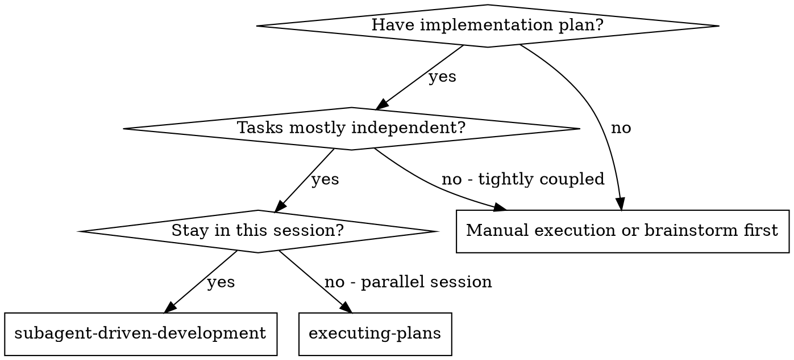
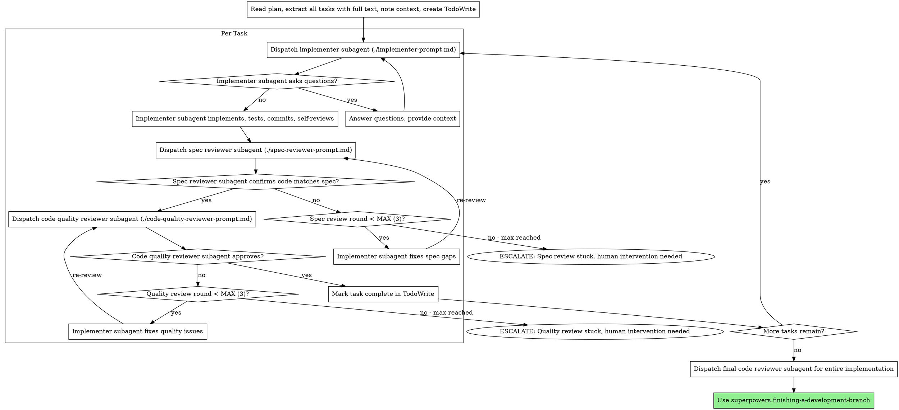
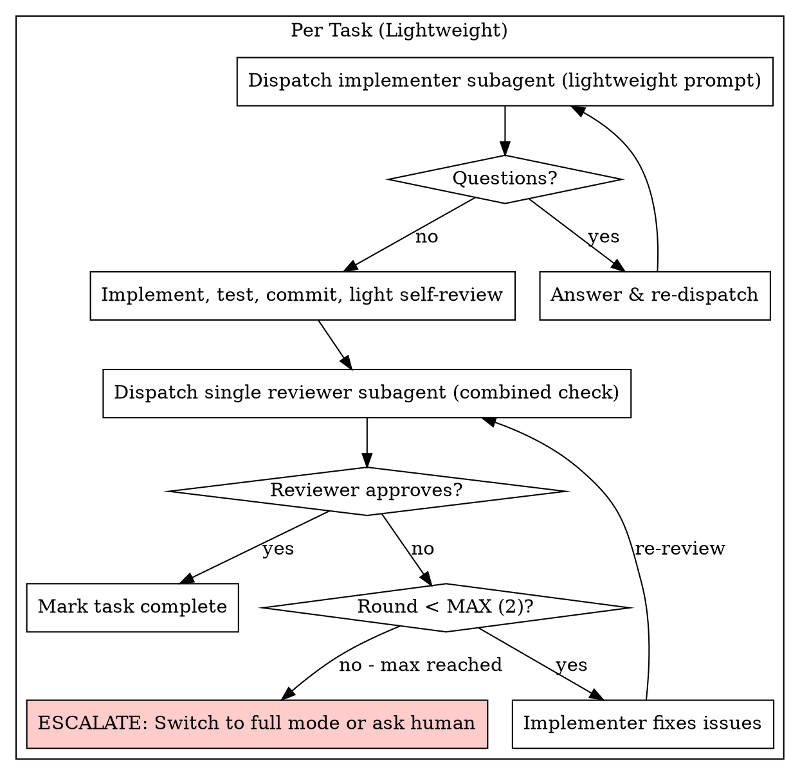

# Subagent-Driven Development

Execute plan by dispatching fresh subagent per task, with two-stage review after each: spec compliance review first, then code quality review.

**Why subagents:** You delegate tasks to specialized agents with isolated context. By precisely crafting their instructions and context, you ensure they stay focused and succeed at their task. They should never inherit your session's context or history — you construct exactly what they need. This also preserves your own context for coordination work.

**Core principle:** Fresh subagent per task + two-stage review (spec then quality) = high quality, fast iteration

**Continuous execution:** Do not pause to check in with your human partner between tasks. Execute all tasks from the plan without stopping. The only reasons to stop are: BLOCKED status you cannot resolve, ambiguity that genuinely prevents progress, or all tasks complete. "Should I continue?" prompts and progress summaries waste their time — they asked you to execute the plan, so execute it.

## When to Use



**vs. Executing Plans (parallel session):**

- Same session (no context switch)
- Fresh subagent per task (no context pollution)
- Two-stage review after each task: spec compliance first, then code quality
- Faster iteration (no human-in-loop between tasks)

## The Process



## Model Selection

Use the least powerful model that can handle each role to conserve cost and increase speed.

**Mechanical implementation tasks** (isolated functions, clear specs, 1-2 files): use a fast, cheap model. Most implementation tasks are mechanical when the plan is well-specified.

**Integration and judgment tasks** (multi-file coordination, pattern matching, debugging): use a standard model.

**Architecture, design, and review tasks**: use the most capable available model.

**Task complexity signals:**

- Touches 1-2 files with a complete spec → cheap model
- Touches multiple files with integration concerns → standard model
- Requires design judgment or broad codebase understanding → most capable model

## Lightweight Mode for Simple Tasks

For tasks that are **non-trivial** (need testing, have some logic) but **simple enough** that full two-stage review is overkill, use **Lightweight Mode**. This cuts overhead by ~60% while keeping quality guarantees.

### When to Use Lightweight Mode

**Use lightweight mode when ALL of these are true:**

- **1-2 files** affected (highly localized change)
- **Spec is unambiguous** (no judgment calls about requirements)
- **No cross-system integration** (no coordination with other modules)
- **Pattern is established** (clear how it should fit in the codebase)
- **No architectural decisions** (just implementing what the plan specifies)

**Common candidates:**
- Adding a single function/method with clear inputs/outputs
- Bug fix where root cause is obvious
- Small refactor (rename, extract helper, simplify logic)
- Adding a validation rule with clear criteria
- Adding a new endpoint handler that follows existing patterns

**Stay in full mode if:**
- Multiple files or cross-module changes
- Spec has open questions or ambiguity
- Requires choosing between approaches
- New public API or interface design
- Changes affect existing behavior of other code paths

### How Lightweight Mode Differs

| Aspect | Full Mode | Lightweight Mode |
|--------|-----------|------------------|
| **Review stages** | 2 (spec + quality) | 1 (combined check) |
| **Max review rounds** | 3 per stage (6 total) | 2 total |
| **Reviewer focus** | Spec compliance + code quality | "Does it work and is it clean?" |
| **Reviewer model** | Most capable | Standard |
| **Implementer model** | Standard or cheap | Cheap (mechanical) |
| **Self-review depth** | Thorough (4 categories) | Light (does it work + obvious issues) |
| **Escalation path** | Continue rounds or escalate to human | Round 2 fails → switch to full mode or escalate |

### Lightweight Mode Process



### Lightweight Reviewer Prompt

```
Task tool (general-purpose):
  description: "Lightweight review for Task N: [name]"
  prompt: |
    You are doing a combined review: does this code do what it should, and is it clean?

    ## Task Spec
    [FULL TEXT of task requirements]

    ## Changes
    [git diff or list of files changed]

    ## Check
    1. **Correctness:** Does it implement the spec? Any obvious bugs?
    2. **Spec compliance:** Missing requirements? Extra features?
    3. **Basic quality:** Clear names? No dead code? Tests exist for new behavior?

    Report:
    - ✅ Approved (works, matches spec, clean enough)
    - ❌ Issues: [list specifically what's wrong]

    Don't nitpick style. Focus on whether this is good enough to ship.
```

### When to Escalate from Lightweight to Full

**Escalation triggers (switch to full mode mid-task):**

- Reviewer finds issues that suggest **spec ambiguity** (not just code problems)
- Fix in round 1 reveals the task is **larger than expected** (touched 3+ files, broke other things)
- Reviewer says **"this needs architectural review"** or similar
- You're about to dispatch round 2 — pause and ask: is this still a simple task?

**How to switch:** Note in TodoWrite that this task upgraded to full mode, then follow the full two-stage review process for subsequent rounds.

### Lightweight Mode Tradeoffs

**What you save:**
- ~60% reduction in review overhead (1 reviewer vs 2, 2 rounds vs 6)
- Cheaper models for both implementer and reviewer
- Faster iteration on simple tasks

**What you risk:**
- Single reviewer might miss issues a two-stage review would catch
- "Good enough" threshold means minor issues may slip through
- False sense of security for tasks that were actually more complex than they seemed

**Mitigation:** The escalation triggers catch the cases where lightweight mode was the wrong choice. Trust them.

## Handling Implementer Status

Implementer subagents report one of four statuses. Handle each appropriately:

**DONE:** Proceed to spec compliance review.

**DONE_WITH_CONCERNS:** The implementer completed the work but flagged doubts. Read the concerns before proceeding. If the concerns are about correctness or scope, address them before review. If they're observations (e.g., "this file is getting large"), note them and proceed to review.

**NEEDS_CONTEXT:** The implementer needs information that wasn't provided. Provide the missing context and re-dispatch.

**BLOCKED:** The implementer cannot complete the task. Assess the blocker:

1. If it's a context problem, provide more context and re-dispatch with the same model
2. If the task requires more reasoning, re-dispatch with a more capable model
3. If the task is too large, break it into smaller pieces
4. If the plan itself is wrong, escalate to the human

**Never** ignore an escalation or force the same model to retry without changes. If the implementer said it's stuck, something needs to change.

## Review Loop Limits

Review loops have a **maximum of 3 rounds per stage** to prevent runaway iterations. After 3 failed reviews at the same stage, **escalate to the human** — the plan or spec may need revision.

| Stage | Max Rounds | Escalation Action |
|-------|------------|-------------------|
| Spec compliance | 3 | Plan is ambiguous or wrong. Pause and ask human to clarify spec or break task into smaller pieces. |
| Code quality | 3 | Implementation may need architectural rethink. Pause and ask human to decide: accept with documented exceptions, or redesign. |

**How to track rounds:** Increment a counter each time you re-dispatch the same reviewer for the same stage on the same task. When the counter hits 3, stop and escalate.

**Escalation format:** Report to the human with:
- Which stage is stuck (spec or quality)
- How many rounds have been attempted
- What issues remain unresolved
- Your assessment: is the spec wrong, or does the implementation need a different approach?

## Prompt Templates

**Full mode (default):**
- `./implementer-prompt.md` - Dispatch implementer subagent
- `./spec-reviewer-prompt.md` - Dispatch spec compliance reviewer subagent
- `./code-quality-reviewer-prompt.md` - Dispatch code quality reviewer subagent

**Lightweight mode (for simple tasks):**
- `./lightweight-implementer-prompt.md` - Dispatch implementer with lighter requirements
- `./lightweight-reviewer-prompt.md` - Single combined review pass

See the "Lightweight Mode" section above for when to use which set.

## Example Workflow

```
You: I'm using Subagent-Driven Development to execute this plan.

[Read plan file once: docs/superpowers/plans/feature-plan.md]
[Extract all 5 tasks with full text and context]
[Create TodoWrite with all tasks]

Task 1: Hook installation script

[Get Task 1 text and context (already extracted)]
[Dispatch implementation subagent with full task text + context]

Implementer: "Before I begin - should the hook be installed at user or system level?"

You: "User level (~/.config/superpowers/hooks/)"

Implementer: "Got it. Implementing now..."
[Later] Implementer:
  - Implemented install-hook command
  - Added tests, 5/5 passing
  - Self-review: Found I missed --force flag, added it
  - Committed

[Dispatch spec compliance reviewer]
Spec reviewer: ✅ Spec compliant - all requirements met, nothing extra

[Get git SHAs, dispatch code quality reviewer]
Code reviewer: Strengths: Good test coverage, clean. Issues: None. Approved.

[Mark Task 1 complete]

Task 2: Recovery modes

[Get Task 2 text and context (already extracted)]
[Dispatch implementation subagent with full task text + context]

Implementer: [No questions, proceeds]
Implementer:
  - Added verify/repair modes
  - 8/8 tests passing
  - Self-review: All good
  - Committed

[Dispatch spec compliance reviewer]
Spec reviewer: ❌ Issues:
  - Missing: Progress reporting (spec says "report every 100 items")
  - Extra: Added --json flag (not requested)

[Implementer fixes issues]
Implementer: Removed --json flag, added progress reporting

[Spec reviewer reviews again]
Spec reviewer: ✅ Spec compliant now

[Dispatch code quality reviewer]
Code reviewer: Strengths: Solid. Issues (Important): Magic number (100)

[Implementer fixes]
Implementer: Extracted PROGRESS_INTERVAL constant

[Code reviewer reviews again]
Code reviewer: ✅ Approved

[Mark Task 2 complete]

...

[After all tasks]
[Dispatch final code-reviewer]
Final reviewer: All requirements met, ready to merge

Done!
```

## Advantages

**vs. Manual execution:**

- Subagents follow TDD naturally
- Fresh context per task (no confusion)
- Parallel-safe (subagents don't interfere)
- Subagent can ask questions (before AND during work)

**vs. Executing Plans:**

- Same session (no handoff)
- Continuous progress (no waiting)
- Review checkpoints automatic

**Efficiency gains:**

- No file reading overhead (controller provides full text)
- Controller curates exactly what context is needed
- Subagent gets complete information upfront
- Questions surfaced before work begins (not after)

**Quality gates:**

- Self-review catches issues before handoff
- Two-stage review: spec compliance, then code quality
- Review loops ensure fixes actually work
- Spec compliance prevents over/under-building
- Code quality ensures implementation is well-built

**Cost:**

- More subagent invocations (implementer + 2 reviewers per task)
- Controller does more prep work (extracting all tasks upfront)
- Review loops add iterations (capped at 3 per stage to prevent runaway costs)
- But catches issues early (cheaper than debugging later)

## Red Flags

**Never:**

- Start implementation on main/master branch without explicit user consent
- Skip reviews (spec compliance OR code quality)
- Proceed with unfixed issues
- Dispatch multiple implementation subagents in parallel (conflicts)
- Make subagent read plan file (provide full text instead)
- Skip scene-setting context (subagent needs to understand where task fits)
- Ignore subagent questions (answer before letting them proceed)
- Accept "close enough" on spec compliance (spec reviewer found issues = not done)
- Skip review loops (reviewer found issues = implementer fixes = review again)
- Let implementer self-review replace actual review (both are needed)
- **Start code quality review before spec compliance is ✅** (wrong order)
- Move to next task while either review has open issues

**If subagent asks questions:**

- Answer clearly and completely
- Provide additional context if needed
- Don't rush them into implementation

**If reviewer finds issues:**

- Implementer (same subagent) fixes them
- Reviewer reviews again
- Repeat until approved or **max 3 rounds per stage** — then escalate to human
- Don't skip the re-review

**If subagent fails task:**

- Dispatch fix subagent with specific instructions
- Don't try to fix manually (context pollution)

## Integration

**Required workflow skills:**

- **superpowers:using-git-worktrees** - Ensures isolated workspace (creates one or verifies existing)
- **superpowers:writing-plans** - Creates the plan this skill executes
- **superpowers:requesting-code-review** - Code review template for reviewer subagents
- **superpowers:finishing-a-development-branch** - Complete development after all tasks

**Subagents should use:**

- **superpowers:test-driven-development** - Subagents follow TDD for each task

**Alternative workflow:**

- **superpowers:executing-plans** - Use for parallel session instead of same-session execution
